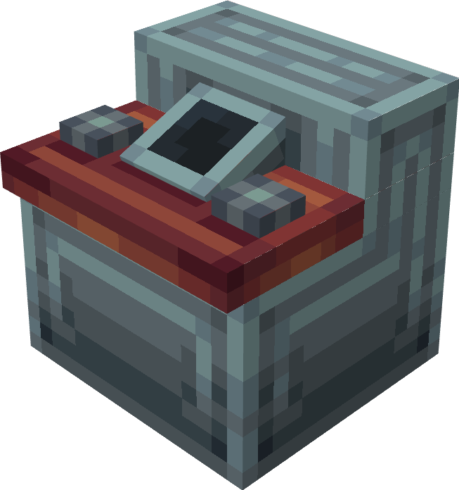

#   Food Machine
This block lets you exchange some of your TARDIM's fuel for food.

I plan to make it work with datapacks and let you switch between different types of food at different prices.

However, right now it is creative mode only and dispenses bread. If you want, you can add crafting recipe for it on your own, 
but it is not recommended since I haven't finished it yet