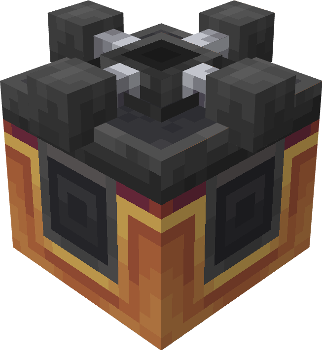
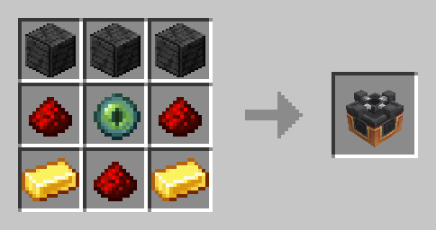

#   Digital TARDIM Interface
This peripheral allows you to do basically anything any other TARDIM control panel can, but automatically.

Attach name - `"digital_tardim_interface"`

## Crafting



## Methods

### `getFuel()`
Get how much fuel the TARDIM has.

**Returns**

1. `number` The amount of fuel, from 0 to 100. Not rounded.

---

### `calculateFuelForJourney()`

Get how much fuel the TARDIM would use if you travelled to destination.

**Returns**

1. `number` The amount of fuel

---

### `isLocked()`

Check whether the TARDIM's doors are locked

**Returns**

1. `bool` Whether the doors are locked

---

### `setLocked(locked)`

Sets the TARDIM's lock

**Parameters**

1. locked `bool`: true to lock doors, false to unlock

---

### `isInFlight()`

Check whether the TARDIM is in flight

**Returns**

1. `bool` Whether the TARDIM is in flight

---


### `getTimeEnteredFlight()`

Get UNIX timestamp of when the TARDIM entered flight

**Returns**

1. `number` Unix timestamp or -1 if TARDIM is landed

---

### `getOwnerName()`

Will write the given input to the linked display.

**Returns**

1. `string` The username of TARDIM's owner

---

### `getCurrentLocation()`

Retrieve the TARDIM's current location

**Returns**

1. `table` The location of the tardim:

   ```
    {
        dimension = "minecraft:overworld",  -- Dimension string
        pos = {  -- Coordinates
            x = 1,
            y = 2,
            z = 3
        }    
    }
   ```

---

### `getTravelLocation()`

The same as `getCurrentLocation()` but for destination

---

### `getCompanions()`

Get all list of all companions in the TARDIM

**Returns**

1. `table` list of companions' names

---

### `setDimension(dimension)`

Set TARDIM's destination to a dimension

**Parameters**

1. dimension `string`: dimension's name e.g. "minecraft:overworld"

---

### `setTravelLocation(x, y, z)`

Set TARDIM's destination coordinates

**Parameters**

1. x `number`: x-axis of destination
2. y `number`: y-axis of destination
3. z `number`: z-axis of destination

---


### `home()`

Set TARDIM's destination to roughly owner's respawn point

---

### `locatePlayer(username)`

Set TARDIM's destination to a player's coordinates

**Parameters**

1. username `string`: player's username. the player must be online.

---

### `getOnlinePlayers()`

Get all list of all online players

**Returns**

1. `table` list of players' names

---

### `getDoorRotation()`

Get current door rotation

**Returns**

1. `string` direction - "north"/"west"/"south"/"east"

---

### `setDoorRotation(rotation)`

Get current door rotation

**Parameters**

1. rotation `string` direction string - "north"/"west"/"south"/"east"

---

### `toggleDoorRotation()`

Toggle door rotation north -> east -> south -> west -> north

---

### `coordAdd(axis, amount)`

Add a number to the destination's coordinates

**Parameters**

1. axis `string` x/y/z
2. amount `number` how much to add/substract

---

### `demat()`

Dematerialise the TARDIM. Throws if TARDIM is in flight already.

---

### `remat()`

Re-materialise the TARDIM at the destination.

**Throws if**

1. TARDIM landing is obstructed
2. Not enough fuel for journey
3. TARDIM is still taking off
4. TARDIM has already landed

---

### `locateBiome(biome)`

Set destination to somewhere in a specific biome.

**Parameters**

1. biome `string` biome name e.g. minecraft:badlands or terralith:skylands_spring

**Throws if**

1. Biome has not been founded near
2. Biome name is wrong

---

### `setSkin(skin)`

Set TARDIM's exterior to a skin

**Parameters**

1. skin `string` exterior name e.g. "TARDIM Type 2k18" or "TARDIM Soviet Chronobox"

**Throws if**

1. Skin was not found

---

### `getSkins()`

Get all list of all available exteriors

**Returns**

1. `table` list of exteriors' names

---

### `setSkin(skin)`

Set TARDIM's exterior to a skin

**Parameters**

1. skin `string` exterior name e.g. "TARDIM Type 2k18" or "TARDIM Soviet Chronobox"

---

### `cloisterBell()`

Play the cloister bell sound in the exterior (originates from the peripheral block)

**Throws if**

1. There was an error playing the sound (unlikely)

---

### `getBiomes()`

Get all list of all existing biomes

**Returns**

1. `table` list of biomes' names

---

### `getDimensions()`

Get all list of all existing dimensions

**Returns**

1. `table` list of dimensions' names
