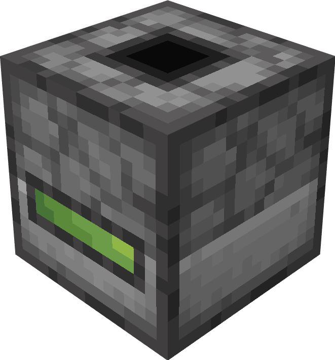

#   Fuel Storage Block
This peripheral, attached to a TARDIM fuel storage block, gives you access to 2 fuel-related methods

Attach name - `"tardim_fuel_storage"`

## Methods

### `getFuel()`
Get how much fuel the TARDIM has.

**Returns**

1. `number` The amount of fuel, from 0 to 100. Not rounded.

---

### `calculateFuelForJourney()`

Get how much fuel the TARDIM would use if you travelled to destination.

**Returns**

1. `number` The amount of fuel