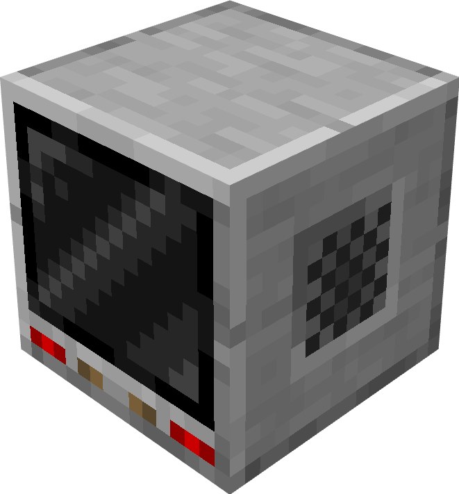

#   TARDIM Scanner Block
This peripheral, attached to TARDIM's scanner block, lets you fetch some data related to world's environment

Attach name - `"tardim_scanner"`

## Methods

### `getOwnerName()`

Will write the given input to the linked display.

**Returns**

1. `string` The username of TARDIM's owner

---

### `getCompanions()`

Get all list of all companions in the TARDIM

**Returns**

1. `table` list of companions' names

---

### `getOnlinePlayers()`

Get all list of all online players

**Returns**

1. `table` list of players' names

---

### `getSkins()`

Get all list of all available exteriors

**Returns**

1. `table` list of exteriors' names

---

### `getBiomes()`

Get all list of all existing biomes

**Returns**

1. `table` list of biomes' names

---

### `getDimensions()`

Get all list of all existing dimensions

**Returns**

1. `table` list of dimensions' names
