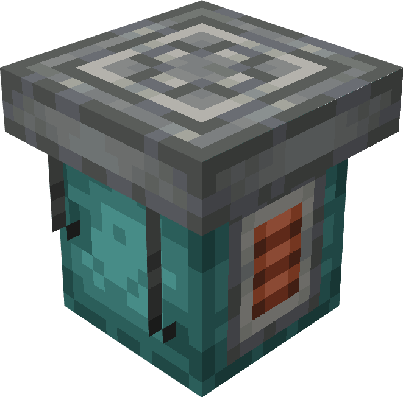
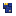
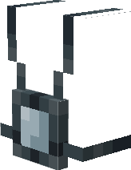

# Planned features
I do not guarantee these will be added or have a timeline, but here are features I designed and wish to implement in the future

*  TARDIM Dock - A block that lets you get to a location by a simple ID and handles location and rotation for you. This will also let TARDIMs land on Create: Aeronautics contraptions once that mod is out
*  Location cartridges - No code way to save location to an item and travel there whenever you want.
*  Personal location jammer - Wearable item that lets you prevent others from locking onto your position.
